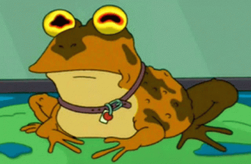

# hold-the-toad

> ⚠️ **ВАЖНОЕ ПРЕДУПРЕЖДЕНИЕ (DISCLAIMER)** ⚠️
>
> Весь код, конфигурации и материалы в этом репозитории созданы **исключительно с помощью генеративных нейросетей (AI)** в ознакомительных и учебных целях.
>
> Автор этого репозитория **не несёт никакой ответственности** за:
> * Работу предоставленных конфигураций
> * Любые последствия их использования
> * Актуальность ссылок и файлов
> * Соответствие законам вашей страны
>
> Все материалы предоставляются **КАК ЕСТЬ (AS IS)**, без каких-либо гарантий. Используя этот репозиторий, вы берёте всю ответственность на себя.
>
> *Данный проект — чисто технический эксперимент по автоматизации с использованием AI.*

---

## 📁 Содержание

* `give-me-back-my-toad.bin` — автоматически обновляемый исполняемый файл роботом AI

## 🔗 Прямая ссылка

https://raw.githubusercontent.com/ProSecureCodeByDaniil/hold-the-toad/main/give-me-back-my-toad.bin

---

*Последнее обновление: автоматически*
🔧 System sync daemon 0x7F438UR8AZA
